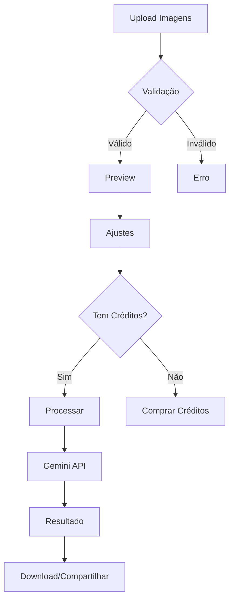
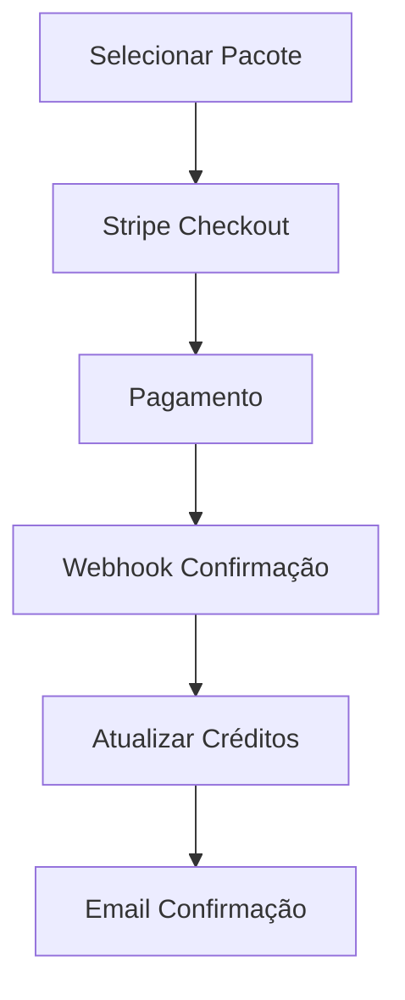

## 📋 **PRD - TattooPreview App**
### Product Requirements Document v1.0

---

## 1. **VISÃO EXECUTIVA**

### 1.1 Objetivo do Produto
Desenvolver uma aplicação web que permite aos usuários visualizar como tatuagens ficariam em seus corpos usando IA avançada (Google Gemini 2.5 Flash Image Preview), oferecendo uma experiência realista antes de tomar a decisão de tatuar.

### 1.2 Proposta de Valor
- **Para usuários**: Experimentar tatuagens virtualmente com qualidade fotorrealista
- **Para tatuadores**: Ferramenta de pré-visualização para clientes
- **Para o negócio**: Monetização através de sistema de créditos

### 1.3 Métricas de Sucesso
- Taxa de conversão free-to-paid: >15%
- Retenção D7: >40%
- NPS: >8
- Tempo de processamento: <10s
- Custo por processamento: <$0.05

---

## 2. **PERSONAS E CASOS DE USO**

### 2.1 Personas Primárias

**Persona 1: Explorador Cauteloso**
- 25-35 anos
- Considera fazer primeira tatuagem
- Precisa visualizar antes de decidir
- Sensível a preço

**Persona 2: Entusiasta de Tatuagens**
- 20-40 anos
- Já possui tatuagens
- Quer testar novos designs/locais
- Disposto a pagar por qualidade

**Persona 3: Profissional/Tatuador**
- Usa como ferramenta de trabalho
- Precisa de alta qualidade
- Volume alto de uso

### 2.2 User Stories Principais

```
Como usuário, quero:
- Fazer upload de minha foto e ver uma tatuagem aplicada realisticamente
- Remover digitalmente uma tatuagem existente para ver como ficaria
- Melhorar a qualidade de fotos de tatuagens existentes
- Ajustar posição, tamanho e rotação da tatuagem
- Baixar o resultado em alta resolução
- Compartilhar o resultado nas redes sociais
```

---

## 3. **REQUISITOS FUNCIONAIS**

### 3.1 Autenticação e Onboarding
| ID | Requisito | Prioridade | Status |
|----|-----------|------------|--------|
| F01 | Login via Google OAuth | P0 | ✅ Existente |
| F02 | 3 créditos grátis ao criar conta | P0 | 🔄 Pendente |
| F03 | Onboarding em 3 passos máximo | P1 | 🔄 Pendente |

### 3.2 Sistema de Créditos
| ID | Requisito | Prioridade | Status |
|----|-----------|------------|--------|
| F04 | Contador visual de créditos no header | P0 | 🔄 Pendente |
| F05 | 1 crédito = 1 processamento | P0 | 🔄 Pendente |
| F06 | 4 pacotes de créditos (5/15/40/100) | P0 | 🔄 Pendente |
| F07 | Histórico de uso de créditos | P2 | 🔄 Pendente |

### 3.3 Processamento de Imagem
| ID | Requisito | Prioridade | Status |
|----|-----------|------------|--------|
| F08 | Modo adicionar tatuagem | P0 | 🔄 Pendente |
| F09 | Modo remover tatuagem | P0 | 🔄 Pendente |
| F10 | Modo retocar/melhorar tatuagem | P0 | 🔄 Pendente |
| F11 | Upload drag-and-drop | P0 | 🔄 Pendente |
| F12 | Preview em tempo real | P1 | 🔄 Pendente |
| F13 | Controles de ajuste (posição/tamanho/rotação) | P0 | 🔄 Pendente |
| F14 | Seletor de parte do corpo | P1 | 🔄 Pendente |

### 3.4 Resultados e Compartilhamento
| ID | Requisito | Prioridade | Status |
|----|-----------|------------|--------|
| F15 | Download em alta resolução | P0 | 🔄 Pendente |
| F16 | Comparação antes/depois | P1 | 🔄 Pendente |
| F17 | Compartilhar em redes sociais | P2 | 🔄 Pendente |
| F18 | Salvar no histórico do usuário | P1 | 🔄 Pendente |

### 3.5 Pagamentos
| ID | Requisito | Prioridade | Status |
|----|-----------|------------|--------|
| F19 | Integração com Stripe | P0 | 🔄 Pendente |
| F20 | Checkout seguro | P0 | 🔄 Pendente |
| F21 | Confirmação via webhook | P0 | 🔄 Pendente |
| F22 | Recibos por email | P2 | 🔄 Pendente |

---

## 4. **REQUISITOS NÃO-FUNCIONAIS**

### 4.1 Performance
| ID | Requisito | Meta | Prioridade |
|----|-----------|------|------------|
| NF01 | Tempo de processamento | <10s | P0 |
| NF02 | Tempo de carregamento da página | <3s | P1 |
| NF03 | Tamanho máximo de upload | 10MB | P0 |
| NF04 | Resolução de output | Até 2048x2048 | P1 |

### 4.2 Segurança
| ID | Requisito | Descrição | Prioridade |
|----|-----------|-----------|------------|
| NF05 | LGPD/GDPR compliance | Conformidade total | P0 |
| NF06 | Processamento server-side | Não expor API keys | P0 |
| NF07 | Rate limiting | 10 req/min por usuário | P0 |
| NF08 | Validação NSFW | Filtro de conteúdo | P1 |
| NF09 | Criptografia de dados | HTTPS/TLS 1.3 | P0 |

### 4.3 Usabilidade
| ID | Requisito | Meta | Prioridade |
|----|-----------|------|------------|
| NF10 | Mobile responsivo | 100% funcional | P0 |
| NF11 | Acessibilidade | WCAG 2.1 AA | P2 |
| NF12 | Browser support | Chrome, Safari, Firefox, Edge | P0 |
| NF13 | Dark mode | Default | P1 |

---

## 5. **ARQUITETURA TÉCNICA**

### 5.1 Stack Tecnológico

```yaml
Frontend:
  - Framework: Next.js 15.4.6 (App Router)
  - Language: TypeScript
  - Styling: Tailwind CSS + Shadcn/ui
  - State: React Query + Zustand
  - Forms: React Hook Form + Zod

Backend:
  - Runtime: Next.js API Routes
  - Database: PostgreSQL (Supabase)
  - ORM: Drizzle
  - Auth: Better-auth (Google OAuth)
  
AI/Processing:
  - Model: Google Gemini 2.5 Flash Image Preview
  - SDK: @google/genai
  - Image Processing: Sharp
  - Storage: Cloudinary (temporário)

Infrastructure:
  - Hosting: Vercel
  - CDN: Cloudinary
  - Payments: Stripe
  - Monitoring: Vercel Analytics
```

### 5.2 Esquema de Banco de Dados

```sql
-- Extensão do schema existente
userCredits:
  - id: text (PK)
  - userId: text (FK -> user.id)
  - totalCredits: integer
  - usedCredits: integer
  - freeCreditsUsed: integer
  - createdAt: timestamp
  - updatedAt: timestamp

imageProcessing:
  - id: text (PK)
  - userId: text (FK -> user.id)
  - type: enum ('add', 'remove', 'enhance')
  - status: enum ('pending', 'processing', 'completed', 'failed')
  - inputImageUrl: text
  - tattooImageUrl: text (nullable)
  - outputImageUrl: text (nullable)
  - processingTime: integer (ms)
  - creditCost: integer
  - metadata: jsonb
  - createdAt: timestamp

creditPackages:
  - id: text (PK)
  - name: text
  - credits: integer
  - price: decimal
  - stripePriceId: text
  - active: boolean

purchases:
  - id: text (PK)
  - userId: text (FK -> user.id)
  - packageId: text (FK -> creditPackages.id)
  - stripePaymentIntentId: text
  - amount: decimal
  - status: enum ('pending', 'completed', 'failed')
  - createdAt: timestamp
```

---

## 6. **FLUXOS DETALHADOS**

### 6.1 Fluxo de Processamento de Imagem



### 6.2 Fluxo de Compra de Créditos



---

## 7. **PROMPTS OTIMIZADOS PARA GEMINI 2.5**

### 7.1 Prompt para Adicionar Tatuagem

```typescript
const addTattooPrompt = `
Scene Description: Apply the provided tattoo design to the person's ${bodyPart} 
using photorealistic tattoo application techniques.

Technical Requirements:
- Tattoo Integration: Follow natural body contours and muscle definition
- Skin Texture: Preserve pores, hair follicles, and natural skin variations
- Ink Appearance: Fresh black ink with proper saturation levels
- Lighting: Match ambient lighting, add subtle skin gloss over tattoo
- Perspective: Maintain anatomically correct perspective warping
- Size: ${size}% of the ${bodyPart} area
- Position: ${position} of the ${bodyPart}
- Rotation: ${rotation} degrees following body curve

Photographic Style: Professional tattoo portfolio photography, 85mm lens, 
soft studio lighting, shallow depth of field focusing on tattoo detail.

Preserve: All natural marks, skin tone variations, body hair, and original image quality.
Do not change the aspect ratio or image dimensions.
`;
```

---

## 8. **ROADMAP DE DESENVOLVIMENTO**

### Sprint 1 (Semana 1-2): Fundação
- [ ] Setup Gemini API e dependências
- [ ] Schema do banco de dados
- [ ] Sistema de créditos básico
- [ ] Serviço de processamento core

### Sprint 2 (Semana 3-4): Interface Principal
- [ ] Página principal /tattoo
- [ ] Upload de imagens
- [ ] Editor com controles
- [ ] API routes

### Sprint 3 (Semana 5-6): Processamento e Resultados
- [ ] Integração completa Gemini
- [ ] Página de resultados
- [ ] Download HD
- [ ] Otimizações de performance

### Sprint 4 (Semana 7-8): Monetização
- [ ] Integração Stripe
- [ ] Sistema de pacotes
- [ ] Webhooks de pagamento
- [ ] Dashboard de créditos

### Sprint 5 (Semana 9-10): Polish
- [ ] Landing page
- [ ] Onboarding
- [ ] Feedback/notificações
- [ ] Testes E2E

---

## 9. **RISCOS E MITIGAÇÕES**

| Risco | Impacto | Probabilidade | Mitigação |
|-------|---------|---------------|-----------|
| API Gemini instável (preview) | Alto | Médio | Fallback para versão estável |
| Custos de processamento altos | Alto | Baixo | Otimização de prompts, cache |
| Qualidade insatisfatória | Alto | Médio | Iteração de prompts, QA rigoroso |
| Rate limits da API | Médio | Baixo | Queue system, retry logic |
| NSFW content | Alto | Baixo | Validação prévia, termos claros |

---

## 10. **CRITÉRIOS DE ACEITAÇÃO**

### MVP (Mínimo Produto Viável)
- ✅ Autenticação Google funcionando
- ✅ 3 modos de processamento operacionais
- ✅ Sistema de créditos implementado
- ✅ Qualidade fotorrealista comprovada
- ✅ Download em alta resolução
- ✅ Pagamento via Stripe
- ✅ Mobile responsivo

### Definição de "Pronto"
- Código revisado e testado
- Documentação atualizada
- Performance dentro das metas
- Acessível em produção
- Analytics configurado

---

## 11. **ANEXOS**

### A. Estimativa de Custos Operacionais
- Gemini API: $0.039/imagem
- Cloudinary: $0.08/GB bandwidth
- Vercel: $20/mês (Pro)
- Supabase: $25/mês
- **Total estimado**: ~$200/mês para 5000 processamentos

### B. Referências Competitivas
- InkHunter (app mobile)
- TattoosAI (web)
- Virtual Tattoo (web)

### C. Compliance Checklist
- [ ] LGPD/GDPR privacy policy
- [ ] Termos de uso
- [ ] Direitos de imagem
- [ ] Age gate (18+)
- [ ] Cookie consent

---

**Versão**: 1.0  
**Data**: Janeiro 2025  
**Status**: Em Revisão  
**Próxima Revisão**: Após Sprint 1